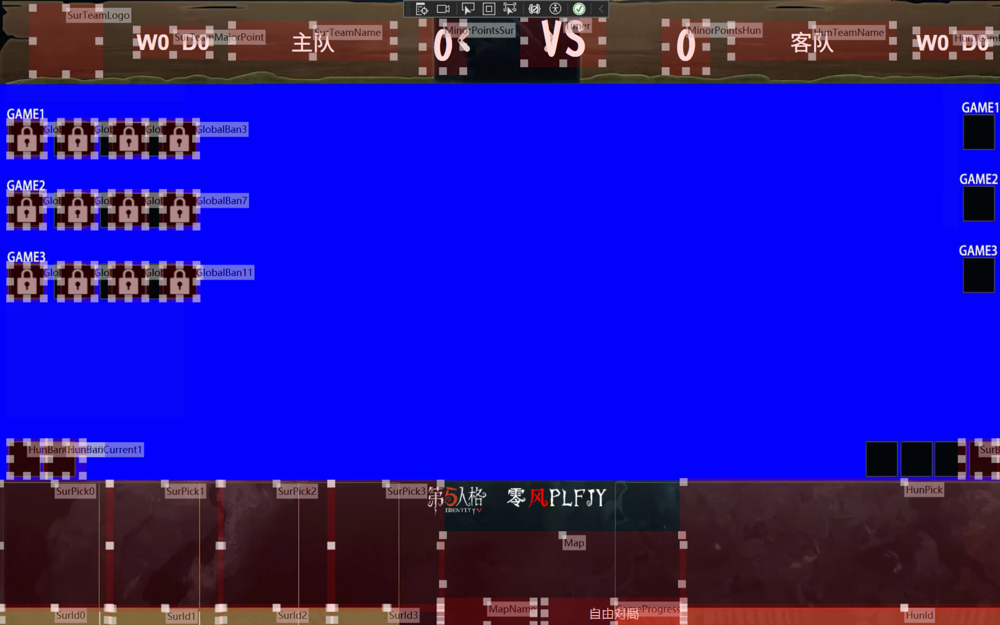

This file includes problems and solutions that are frequently encountered in software use. Please check whether the solution to your problem can be found in this document. Please check before asking for help or submitting an issue in the group.

---

## Frontend Conponents are in wrong position

1. Open Windows settings-系统-屏幕，将缩放设为 200% 以下（建议使用默认缩放值）
2. Open System-Screen and set the zoom to 200% or lower(recommended to use the default zoom value)
2. Restart the software

## Designer mode does not work
This problem is currently unable to solve due to the underlying problem. Please open the frontend UI before enabling the designer mode.