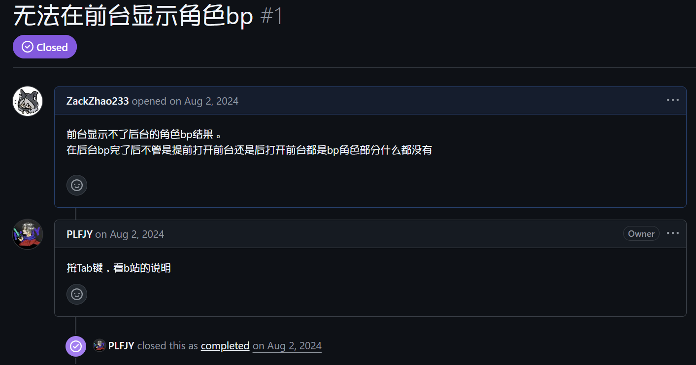

# Introduction

The software is open source under the GPL-3.0 license which is **Completely Free**。

**Differences between the documentation and the software is normal, because the documentation is written based on a very old version.**

**if the layout in frontend windows is incorrect, please go to[Frontend Management](backend/backend-fronted-manager.md) and [settings](backend/backend-settings.md) to reset the settings, this may be caused by the default configuration left by an old version.**

Official Website: [https://bpsys.plfjy.top/](https://bpsys.plfjy.top/)

Project Repository: [https://github.com/PLFJY/neo-bpsys-wpf/](https://github.com/PLFJY/neo-bpsys-wpf/)

Author's QQ：3424127335

QQ Group Number：175741665

‍

**Kind Reminder: Before submitting an issue or feedbacking in the group, please make sure you have checked whether the problem is on the software or your own brain/eyes**

↓This is an example of a stupid issue↓   （++）——S0 Clerk

