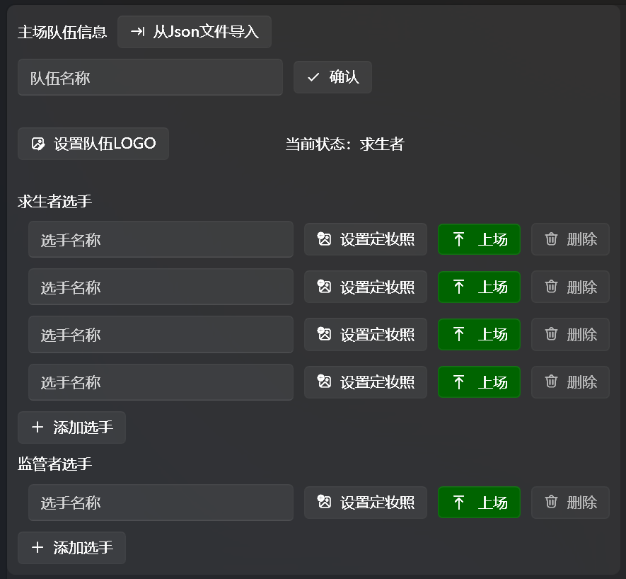
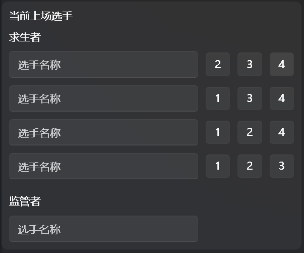
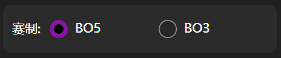
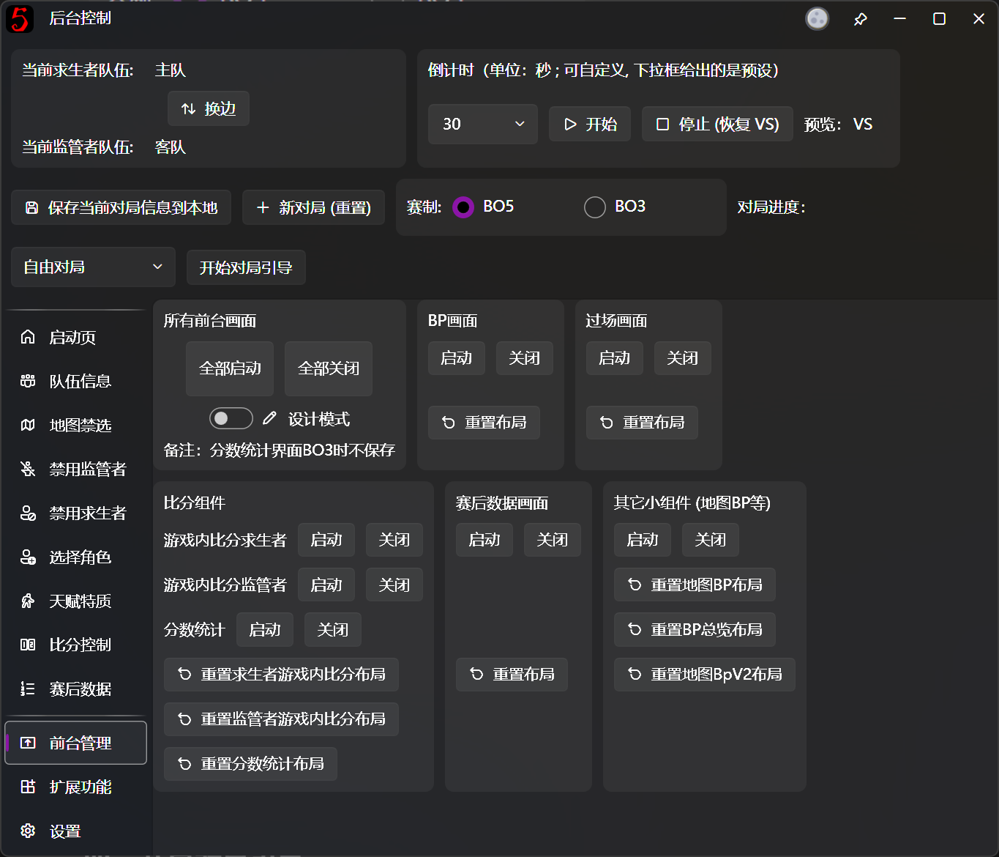
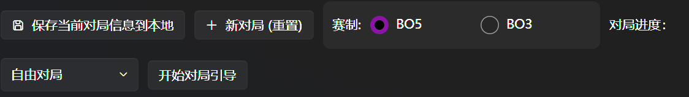
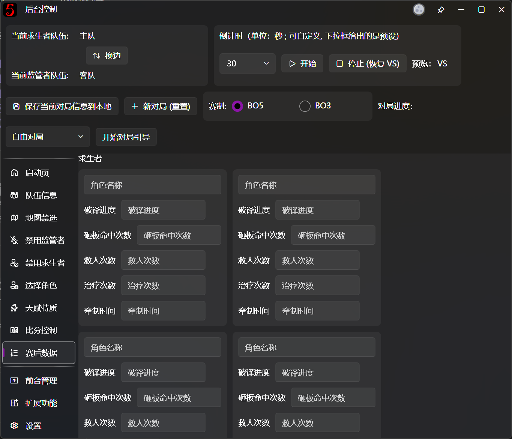
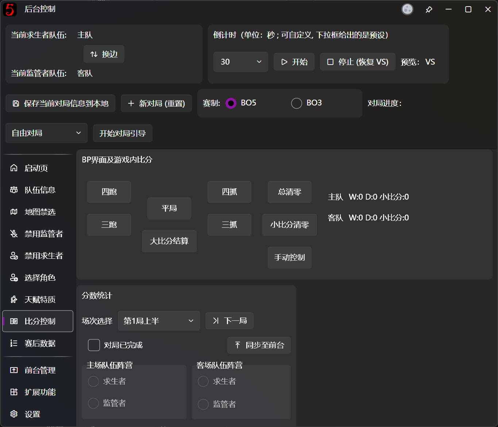

# Quick Start

## Install

### Check System Requirements
Before starting the software, please make sure you have met the following requirements：

+ Windows 10 and above
+ Recommended specifications: i5 13400F + RTX 3060 +16GB RAM（Lowest: i5 8300H + GTX 1060 + 8GB RAM）*
+ [.NET 9.0 Runtime ](https://dotnet.microsoft.com/zh-cn/download/dotnet/9.0) is installed.

> *Note that the software can run on integrated graphics, but we do not recommend to be

---

### Downloads
You can download the software from the following sources:

+ [Official Website](../../#download-center)
+ [GitHub Releases](https://github.com/PLFJY/neo-bpsys-wpf/releases)

## Basic usage

If you are new to this software, please follow the steps below to get started:

---

### 1. Set Team Information
Click the Team Information button on the left side of the software window to set the team information。As for each team, set team name, team logo, name and photo(not compulsory) for each player and click Enter for all players who are currently on the field.

Players on field are shown in the bottom of the page. For each player, you can click the number next to the player's name to switch their position.

If you want to know how to import team information faster, please view [Import from JSON](advanced/import-team-from-json.md)。

---

### 2. Set Match Mode
You can change the match mode on main window. **That setting will effect functions including [Game Guidance](backend/backend-game-info-and-guidance.md) and score calculation，so please select the correct mode**。

---

### 3. Start Fronted
Click [Frontend Management](backend/backend-fronted-manager.md) at the left side of main window. You can manage all the frontend windows here（we recommend you to open all the windows and manage them in live softwares such as [OBS](https://obsproject.com/download)）。**Do NOT enable design mode unless you have a custom frontend layout requirement. If you accidentally enable and move the component position, click the【Reset Layout】button to restore.**

---

### 4. Start Game Guidance
Game guidance is designed according to offcial rules. Please select the current progress（such as game 1 first half）and click【Start Game Guidance】, then click【Next step】 to follow the game rules. You can click【Last step】and【End Game Guidance】to perform corresponding operations.

You can do the BP process according to the guidance. For details of each step：

+ [Map BP](backend/map-bp.md)
+ [Ban Hunter](backend/backend-ban-hunter.md)
+ [Ban Survivor](backend/backend-ban-survivor.md)
+ [Pick Character](backend/backend-pick-character.md)
+ [Talent & Trait](backend/backend-talents-and-trait.md)

---

### 5. Game Statistics
Data of each player in game are shown in [Game Statistics Window](../fronted/fronted-match-statistics.md). Data in Game Statistics Page will be shown in [Game Statistics Window](../fronted/fronted-match-statistics.md)显示。

---

### Score Control
When a game is finished，you can input and calculate scores in [Score System](backend/backend-score-system.md). The scores will be synchronized to [Score Conponent](../fronted/fronted-score.md)中。

The scores of the game are added according to official rules. For details of each score：

| **Game Result** | **Score for Survivor Team** | **Score for Hunter Team** |
| --- | --- | --- |
| 4 elimination | 0 | 5 |
| 3 elimination | 1 | 3 |
| Tie | 2 | 2 |
| 3 escape | 3 | 1 |
| 4 escape | 5 | 0 |

---

### 7. End Game
After finishing one game, Click【New game】to clear the BP result of this game（information including map BP, global ban records, scores, etc will be retained）。
