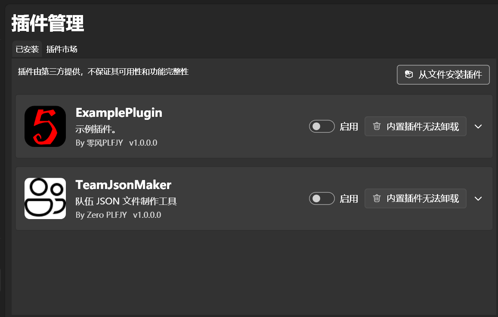

本文介绍了软件的插件系统。如果你的软件无法使用插件系统，请将软件[更新](https://bpsys.plfjy.top/)至2.0.0或更新版本。

---
### 插件管理
上图是插件管理界面。在这里，你可以管理你已经安装的插件。
点击【从文件安装插件】来安装新的插件（zip文件）。
如果前台窗口出现了异常文字，请转到[常见问题及解决方法](../常见问题及解决方法.md)。

---
### 插件市场

前面的区域以后再来探索吧~