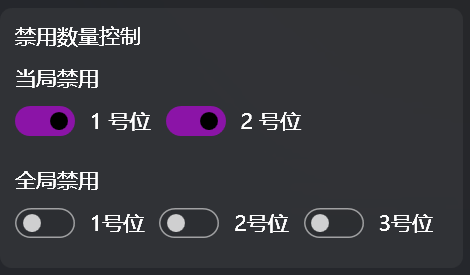

# 禁用监管者

本页面的功能是设置显示在[BP画面](../前台/BP画面.md)上的被禁用的监管者。

本软件内置了2个监管者当局ban位和3个全局ban位。

#### 角色选择器
这里需要引入一个概念——角色选择器，是一个自定义控件，由一个下拉选择框 (又名组合框)、一个确认按钮和一个图片框组成，下拉选择框用于检索和选择角色，支持全称、拼音全拼、拼音首拼搜索，空格键检索，Tab/回车键 确认 (推荐使用Tab，因为回车要按两次) (例：如果想选中“宿伞之魂”，在下拉框中输入“宿伞”后点击 Tab/回车 或输入“sszh/susan”后按空格然后Tab) 

同时，这个控价存在一个变种，只保留下拉选择框的形式，你会在“选择角色”页面见到它，用于全局禁选记录

> 26号守卫支持输入bb来检索（不支持输入邦邦）

‍

同时可以自定义ban位数量.