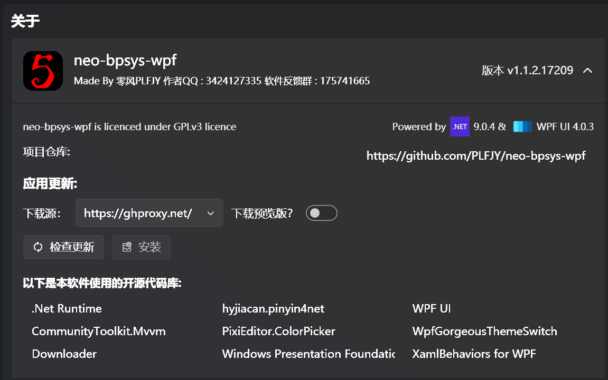

本页面的功能是针对软件进行个性化设置以及显示本软件的各类信息，如作者信息、联系方式、版本号、开源协议、赞助方式等，以及软件的更新信息。

在这里可以查看软件版本、使用的各类开源代码库以及进行软件更新。

软件的更新目前支持3个国内可用的下载源，第四个空的下载源是从源站 (Github) 下载，旁边还有一个下载预览版的开关，现在测试阶段这个开关默认开启，正式版后此开关会默认关闭

【打开前台配置文件所在目录】的作用是便于用户手动修改前台布局。

【打开对局文件输出目录】的作用是使用户查看保存的对局信息‍更方便。

【打开日志目录】 的作用是便于用户在反馈bug时向开发者提供日志。

目前最新版软件已支持深度自定义，如对各类前台窗口的背景及各区域文字的字体、大小、颜色、权重等按需进行调整。

再强调一遍：

## 如果你是付费购买的此软件，那么你一定是被骗了！！！
## 如果你是付费购买的此软件，那么你一定是被骗了！！！
## 如果你是付费购买的此软件，那么你一定是被骗了！！！

  

扫描微信支付二维码来赞助我们对本软件的开发工作，我们非常感谢您的支持！

