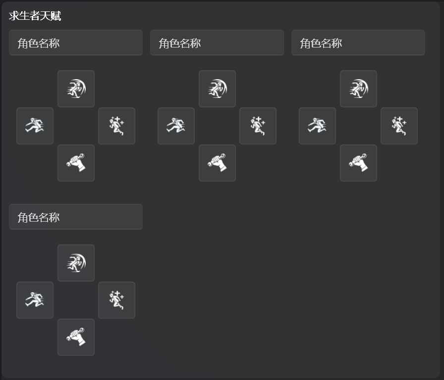
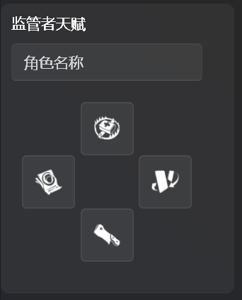
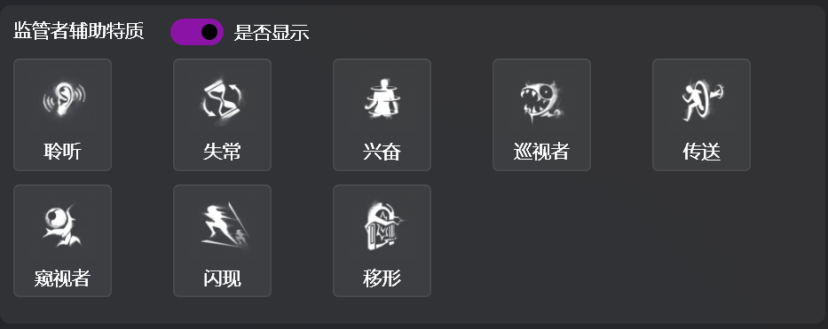

# 天赋特质

本页面的功能是设置在过场画面显示的双方天赋以及监管者辅助特质。

#### 天赋选择器
这里又是一个自定义控件——天赋选择器，由四个ToggleButton组成 (饶了我吧，我不知道怎么翻译它，你知道可以选中就对了)，各个天赋的位置与游戏内完全相同，所以完全可以靠肌肉记忆点出来

#### 辅助特质选择
由于游戏内比赛模式下观战席无法查看监管者携带的辅助特质，本软件允许用户选择是否显示监管者辅助特质（以应对能在游戏开始前知晓监管者方携带的辅助特质的情况）。使用方法为点击监管者选手选择的辅助特质。

