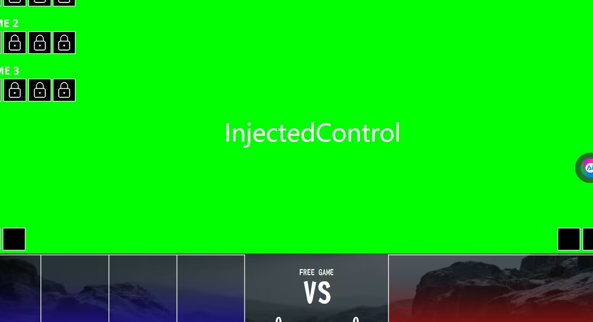

本文档收录了软件使用过程中经常遇见的问题及解决方法，请在群内提问或提交issue前仔细检查遇到的问题是否能够在本文档中找到解决方案。

---

## 前台组件错位

1. 打开 设置-系统-屏幕，将缩放设为 200% 以下（建议使用默认缩放值）
2. 重启软件

## 打开设计者模式没有效果
这个是暂时无法解决的底层问题，请先打开前台UI再打开设计者模式

## 前台窗口出现意义不明的文字（例如InjectedControl）

在侧边栏【插件】中关闭示例插件