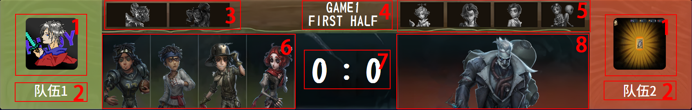

# BP总览

BP总览和[地图BP](地图BP.md)的打开方式都是点击[前台管理页面](../后台/前台管理.md)中的其它小组件。

本功能的作用是在一局游戏结束后显示当局BP以及本局小比分。

以下是本页面各个部分的功能：

1. 队徽
2. 战队名
3. 本局被禁用的监管者
4. 对局进度
5. 本局被禁用的求生者
6. 本局求生者方角色选择
7. 本局小比分
8. 监管者方角色选择

