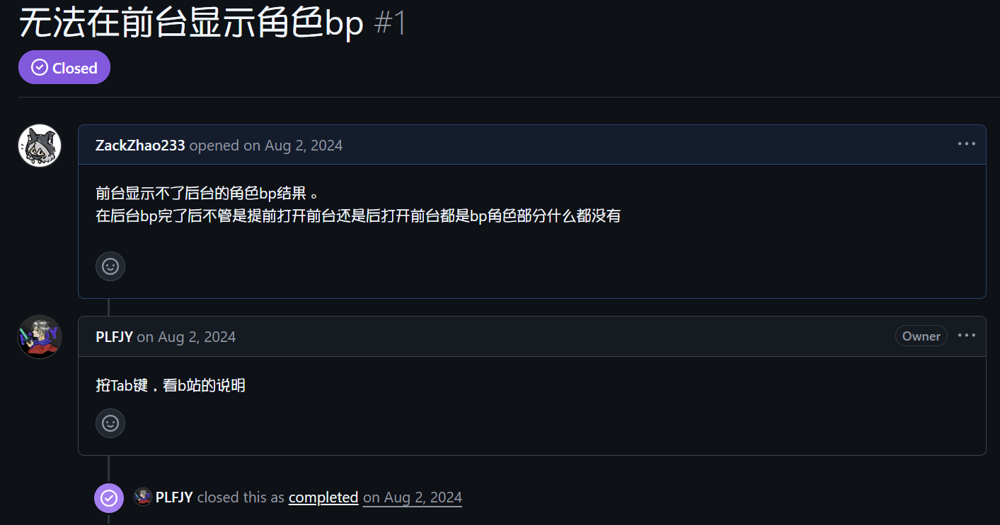

# 前言

软件基于GPL-3.0协议开源，**完全免费**。

**如果你遇到了UI与文档中有些许差异请不要慌张，文档基于软件旧版本完成，如果使用上没有较大程度上的不同暂不考虑更新**

**如果遇到前台控件错误或者消失请前往[前台管理](backend/backend-fronted-manager.md)和[设置](backend/backend-settings.md)页面重置配置，这可能是由于上一个版本留下的默认配置导致的Bug**

官网地址：[https://bpsys.plfjy.top/](https://bpsys.plfjy.top/)

项目地址：[https://github.com/PLFJY/neo-bpsys-wpf/](https://github.com/PLFJY/neo-bpsys-wpf/)

作者QQ：3424127335

QQ交流群号：175741665

‍

**温馨提醒：在GitHub上提交issue或在群内反馈问题前请一定认真检查一下是软件的问题还是自己偷着练邦邦的问题 。**

↓以下是一个唐诗issue的示例↓   （++）——S0记录员

